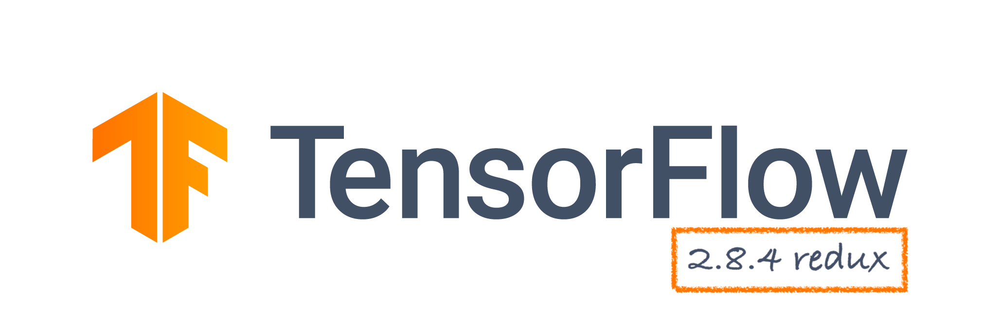
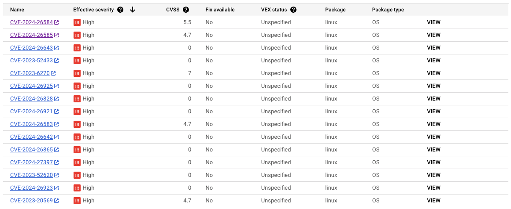

<div align="center">
  
</div>

This repo forks the main [TensorFlow repo](https://github.com/tensorflow/tensorflow). It provides a mechanism to rebuild the [official 2.8.4 version container](https://hub.docker.com/layers/tensorflow/tensorflow/2.8.4-gpu/images/sha256-4351b59baf4887bcf47eb78b34267786f40460a81fef03c9b9f58e7d58f1c7b7?context=explore) using modern OS bases, in particular Ubuntu 22.04 (vs the previous 20.04).

When we built a DeepCell container [using the official 2.8.4 base](https://github.com/dchaley/deepcell-imaging/blob/26e3f4e0797ef9028f67796ad3d70effcc27b545/container/Dockerfile), and the Google vulnerabilities scanner found 548 issues.


There were 15 "High" severity vulnerabilities according to the Google vulnerabilities scanner.



The rebuilt base container has 125 vulnerabilities:


The rebuilt DeepCell container has 129:


TODO: count the change per category.

## Building the container

TODO: instructions

At this point, you have a container you can tag & push. In our case,

```bash
docker tag tensorflow:2.8.4-rebuilt-gpu us-central1-docker.pkg.dev/deepcell-on-batch/deepcell-be
nchmarking-us-central1/base-tf-2.8.4-rebuilt-gpu
docker push us-central1-docker.pkg.dev/deepcell-on-batch/deepcell-benchmarking-us-central1/base-
tf-2.8.4-rebuilt-gpu
```

Yay 🎉

## License

[Apache License 2.0](LICENSE)
